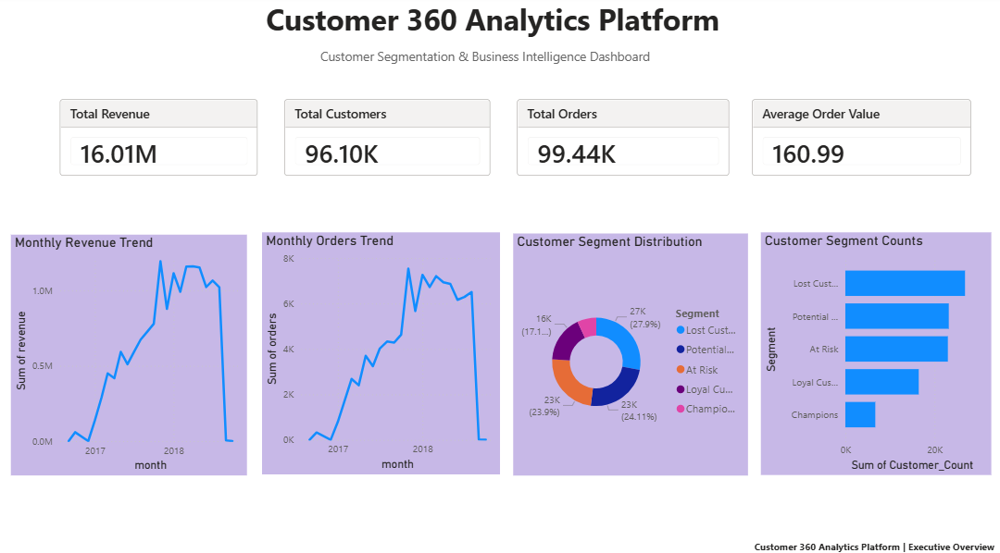
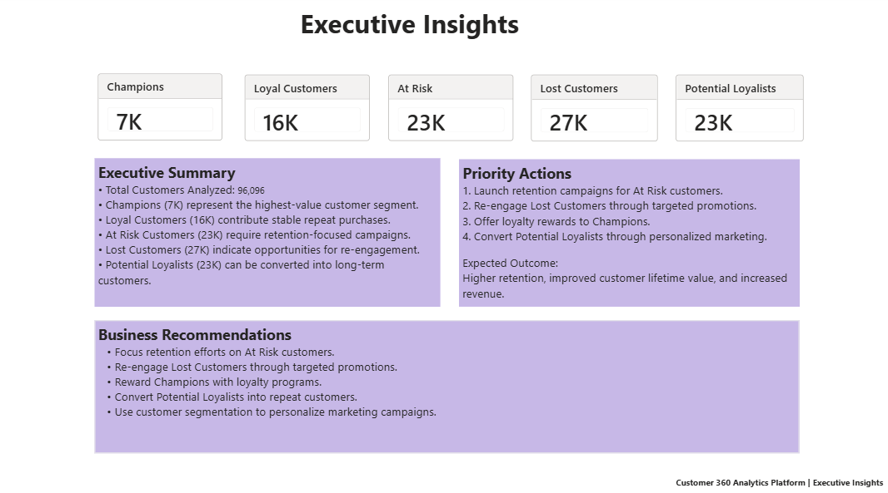
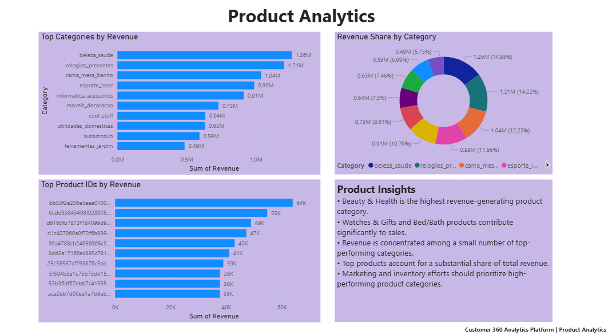
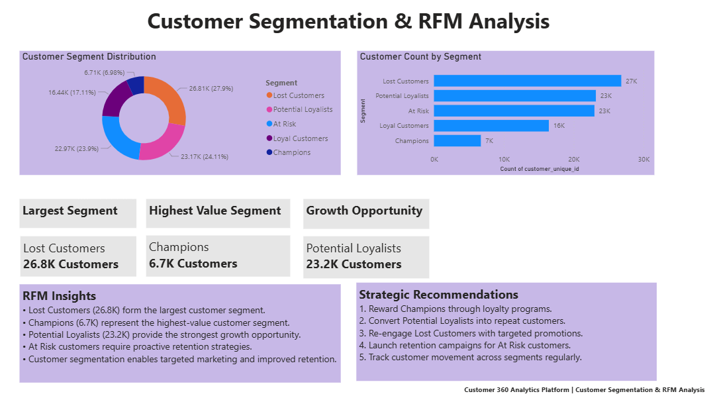

# Customer 360 Analytics Platform

## 1. Project Overview

Customer 360 Analytics Platform is an end-to-end Business Intelligence and Customer Analytics solution developed using Python, MySQL, and Power BI.

The project analyzes customer behavior, purchasing patterns, revenue trends, and product performance to generate actionable business insights. It combines data engineering, customer analytics, RFM segmentation, and interactive dashboards to provide a complete view of business performance.

The platform helps identify high-value customers, customers at risk of churn, growth opportunities, and top-performing products through data-driven analysis.

---

## 2. Business Problem

E-commerce businesses generate large volumes of transactional and customer data. However, without proper analysis, it becomes difficult to:

* Identify valuable customers.
* Detect customers likely to churn.
* Understand purchasing behavior.
* Evaluate product performance.
* Monitor revenue growth.
* Develop effective retention strategies.

This project addresses these challenges by transforming raw transactional data into meaningful business insights and strategic recommendations.

---

## 3. Project Objectives

* Analyze customer purchasing behavior.
* Track revenue and order trends.
* Calculate key business performance metrics.
* Perform customer segmentation using RFM Analysis.
* Identify high-value and at-risk customer groups.
* Analyze product and category performance.
* Create executive dashboards for decision-making.
* Generate actionable business recommendations.

---

## 4. Dataset

The project uses the Olist Brazilian E-Commerce Dataset containing:

* 99,441 Orders
* 96,096 Unique Customers
* Customer Information
* Product Information
* Payment Information
* Order Transactions
* Order Item Details

The dataset was imported into MySQL and processed using Python before being visualized in Power BI.

Dataset Source:
https://www.kaggle.com/datasets/olistbr/brazilian-ecommerce

---

## 5. Technology Stack

### Programming & Analytics

* Python
* Pandas
* SQLAlchemy

### Database

* MySQL

### Visualization

* Power BI

### Analytics Techniques

* Customer Analytics
* RFM Analysis
* Customer Segmentation
* Product Analytics
* Business Intelligence

---

## 6. Setup and Execution

### Prerequisites

Install the following:

* Python 3.x
* MySQL Server
* Power BI Desktop

### Install Required Python Packages

```bash
pip install pandas sqlalchemy pymysql
```

### Create Database

```sql
CREATE DATABASE customer360;
```

### Configure Database Connection

Update the MySQL username, password, and database name in the Python scripts before execution.

The raw Olist datasets should be placed inside the data directory before running the ETL scripts.


---

## 7. Running the Project

### Step 1: Test Database Connection

```bash
python python/test_connection.py
```

### Step 2: Load Data into MySQL

```bash
python python/load_customers.py
python python/load_orders.py
python python/load_order_items.py
python python/load_products.py
python python/load_payments.py
```

### Step 3: Verify Data Loading

```bash
python python/verify_customers.py
```

### Step 4: Generate Customer KPIs

```bash
python python/customer_kpis.py
```

### Step 5: Perform RFM Analysis

```bash
python python/rfm_analysis.py
```

Generated files:

* rfm_scores.csv
* rfm_segmented.csv

### Step 6: Generate Customer Segmentation

```bash
python python/customer_segments.py
```

Generated file:

* customer_segments.csv

### Step 7: Generate Product Analytics

```bash
python python/product_analytics.py
```

Generated files:

* top_categories.csv
* top_products.csv
* category_revenue.csv

### Step 8: Export Dashboard Datasets

```bash
python python/export_dashboard_data.py
```

Generated files:

* revenue_trend.csv
* orders_trend.csv

### Step 9: Open Power BI Dashboard

Open:

```text
dashboard/Customer360_Analytics_Platform.pbix
```

Refresh datasets and view the dashboard.

---

## 8. Project Workflow

### Data Ingestion

Raw e-commerce datasets were imported into MySQL using Python ETL scripts.

Tables created:

* Customers
* Orders
* Order Items
* Products
* Payments

### Data Processing

Python scripts were used to:

* Clean data
* Transform datasets
* Generate analytical datasets
* Export reporting files

### Customer Analytics

Calculated key business metrics:

* Total Customers
* Total Orders
* Total Revenue
* Average Order Value

### RFM Analysis

Customers were scored using:

* Recency
* Frequency
* Monetary Value

Customers were segmented into:

* Champions
* Loyal Customers
* Potential Loyalists
* At Risk Customers
* Lost Customers

### Product Analytics

Analyzed:

* Revenue by Category
* Revenue Share by Category
* Top Products by Revenue

### Dashboard Development

Interactive Power BI dashboards were created to visualize insights and recommendations.

---

## 9. Dashboard Pages

### Executive Overview

Provides a high-level business summary including:

* Total Revenue
* Total Customers
* Total Orders
* Average Order Value
* Revenue Trend Analysis
* Orders Trend Analysis
* Customer Segment Distribution

### Executive Insights

Provides business-focused insights including:

* Customer Segment KPIs
* Executive Summary
* Priority Actions
* Business Recommendations

### Product Analytics

Provides product performance insights including:

* Top Categories by Revenue
* Revenue Share by Category
* Top Products by Revenue
* Product Insights

### Customer Segmentation & RFM Analysis

Provides detailed customer analysis including:

* Customer Segment Distribution
* Customer Count by Segment
* Largest Customer Segment
* Highest Value Customer Segment
* Growth Opportunity Analysis
* Strategic Recommendations

---

## 10. Key Insights

* Lost Customers represent the largest customer segment.
* Champions represent the highest-value customer group.
* Potential Loyalists provide significant growth opportunities.
* Revenue is concentrated among a small number of product categories.
* Customer segmentation enables targeted marketing and retention strategies.
* Product analytics helps identify high-performing categories and products.

---

## 11. Business Recommendations

* Reward Champions using loyalty programs.
* Re-engage Lost Customers using targeted campaigns.
* Convert Potential Loyalists into repeat customers.
* Launch retention initiatives for At Risk customers.
* Use customer segmentation for personalized marketing.
* Focus inventory and marketing efforts on high-performing product categories.

---

## 12. Project Structure

Customer360-Analytics-Platform/

├── dashboard/

│   └── Customer360_Analytics_Platform.pbix

├── python/

│   ├── test_connection.py

│   ├── verify_customers.py

│   ├── load_customers.py

│   ├── load_orders.py

│   ├── load_order_items.py

│   ├── load_products.py

│   ├── load_payments.py

│   ├── customer_kpis.py

│   ├── customer_segments.py

│   ├── rfm_analysis.py

│   ├── product_analytics.py

│   └── export_dashboard_data.py

├── reports/

│   ├── customer_segments.csv

│   ├── revenue_trend.csv

│   ├── orders_trend.csv

│   ├── category_revenue.csv

│   ├── top_categories.csv

│   ├── top_products.csv

│   ├── rfm_scores.csv

│   └── rfm_segmented.csv

├── screenshots/

│   ├── page1_executive_overview.png

│   ├── page2_executive_insights.png

│   ├── page3_product_analytics.png

│   └── page4_customer_segmentation.png

└── README.md

---

## 13. Dashboard Screenshots

### Executive Overview



### Executive Insights



### Product Analytics



### Customer Segmentation & RFM Analysis




---

## 14. Future Improvements

* Customer Lifetime Value (CLV) Analysis
* Customer Churn Prediction
* Machine Learning-Based Recommendations
* Real-Time Dashboard Refresh
* Automated Reporting Pipelines
* Advanced Customer Retention Modeling

---


Skills:

* Python
* SQL
* MySQL
* Power BI
* Data Analytics
* Business Intelligence
* Customer Analytics


